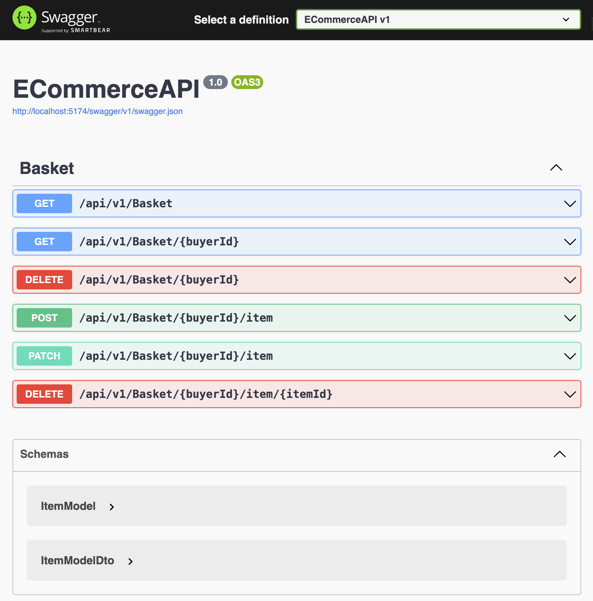

# ECommerceAPI

## About The Project
A Technical Test for Auctria

### Built With
- [.NET 7](https://dotnet.microsoft.com/en-us/download/dotnet/7.0)
- [C#](https://docs.microsoft.com/en-us/dotnet/csharp/)
- [Redis](https://redis.io/) 

## Getting Started
Follow these steps to get a local copy up and running.

### Prerequisites
- .NET 7 SDK: [Download here](https://dotnet.microsoft.com/en-us/download/dotnet/7.0)
- Docker: If you want to run it by Docker, you need to have Docker installed on your system. [Docker's official website](https://www.docker.com/get-started)

### Usage
Use the implemented swagger UI to test the APIs


### Installation
1. Clone the repo
   ```
   git clone https://github.com/Abbasi67m/ECommerceAPI-Project.git
   ```
2. Navigate to the project directory
   ```
   cd ECommerceAPI
   ```
3. Restore dependencies
   ```
   dotnet restore
   ```
4. Build and Run with dotnet
   ```
   dotnet run
   ```
5. Build and Run with Docker Compose:
   ```
   docker-compose up --build
   ```

### Running Tests
Execute the tests

1. Navigate to the test directory
   ```
   cd ECommerceAPI.UnitTests
   ```
2. Restore dependencies
   ```
   dotnet test
   ```
